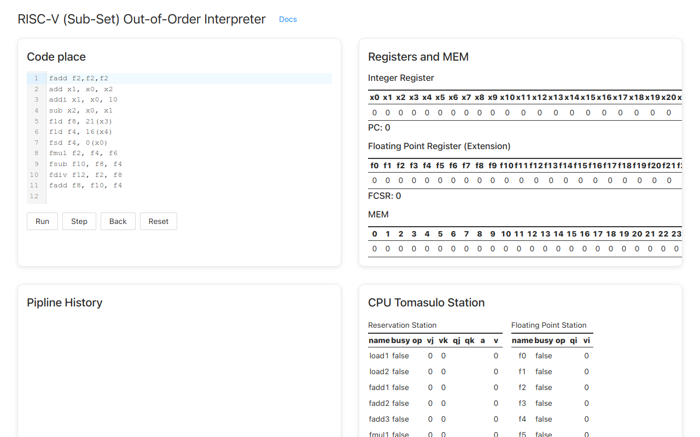

# RISC-V (Sub-Set) Out-of-Order Interpreter



## Getting Started

```bash
# for dev
npm run dev # or `yarn dev`
# for test
npm test # or `yarn test`
```

Open [http://localhost:3000](http://localhost:3000) with your browser to see the result. [Docs](docs/README.md).

## TODO

- [ ] Add more instructions
- [ ] Add Decode Stage and Memory Stage

## Technical Stack

- core: typescript
- ui: next.js && react.js && antd && sass && mdx-js
- test: jest && ts-jest
- compability: core-js


## License

MIT License
